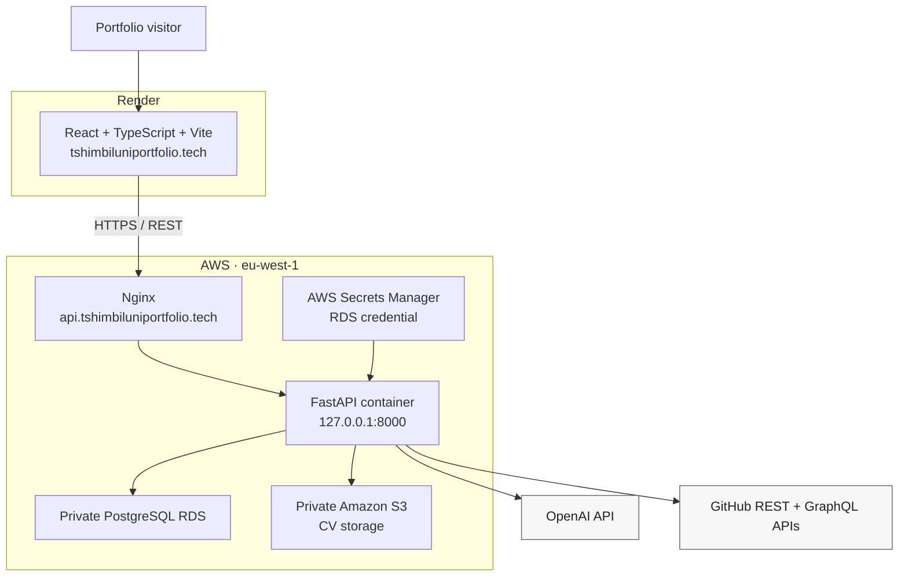

# Tshimbiluni AI-Powered Portfolio

[](LICENSE)
[](https://tshimbiluniportfolio.tech)
[](https://api.tshimbiluniportfolio.tech/docs)
[](frontend)
[](https://github.com/TshimbiluniRSA/my-aws-infrastructure)
[](backend/src/compose.production.yml)

**At a glance:** A production full-stack portfolio with a React frontend, FastAPI backend, embedded AI assistant, live-synced GitHub data, CV parsing and private S3 downloads — deployed across Render and Terraform-managed AWS infrastructure.

**Live portfolio:** [tshimbiluniportfolio.tech](https://tshimbiluniportfolio.tech) · **Production API:** [api.tshimbiluniportfolio.tech](https://api.tshimbiluniportfolio.tech) · **Infrastructure:** [my-aws-infrastructure](https://github.com/TshimbiluniRSA/my-aws-infrastructure)

This is more than a static developer portfolio.

It is a small production system built to demonstrate how I design, integrate, deploy and operate software end to end. Visitors can explore my projects and GitHub activity, download my current CV, and use an AI assistant to ask questions about my experience and technical background.

The application combines independently deployable frontend and backend services with PostgreSQL persistence, OpenAI integration, official GitHub APIs, private Amazon S3 storage, Docker, Nginx and a companion Terraform infrastructure repository.

## Why This Exists

Most portfolios tell you what someone knows.

I wanted mine to **demonstrate it**.

This project gives me a practical environment for working across:

* backend API design;
* asynchronous Python;
* React and TypeScript;
* relational persistence;
* LLM integration;
* external API integration;
* document processing;
* Docker;
* production configuration;
* cloud networking and IAM;
* database migrations;
* object storage;
* DNS and HTTPS; and
* application deployment and operations.

It is intentionally small enough to understand end to end while still containing real production trade-offs around security, cost, deployment, persistence and external integrations.

## What It Does

### AI Portfolio Assistant

The portfolio includes an embedded conversational assistant that visitors can use to ask questions about:

* my software engineering experience;
* technical skills;
* projects;
* professional background; and
* portfolio data.

The backend uses the OpenAI Responses API together with contextual portfolio data.

The chat is embedded directly into the portfolio page rather than hidden behind a modal, allowing visitors to continue scrolling through both the conversation and the rest of the site.

### GitHub Synchronisation

Portfolio GitHub data is synchronised from the official GitHub APIs and stored locally rather than fetched live on every public request.

The synchronisation process collects information such as:

* profile data;
* repository aggregates;
* languages;
* recent repositories; and
* contribution statistics.

Public visitors read cached application data, while mutation and synchronisation endpoints require a dedicated `X-GitHub-Sync-Token`.

### CV Upload and AI Parsing

A PDF CV can be uploaded through the API and processed into structured portfolio data.

The production upload workflow uses private Amazon S3 storage and removes temporary uploaded objects after processing where configured.

### Private CV Download

The current public CV is stored in a private S3 bucket.

The application does **not** make the bucket public. Instead:

1. the backend verifies the configured object;
2. generates a short-lived presigned S3 URL; and
3. returns that URL to the frontend for download.

This keeps storage private while still allowing visitors to download the current CV.

### API-First Backend

Portfolio functionality is exposed through FastAPI REST endpoints.

Interactive production documentation is available at:

**[api.tshimbiluniportfolio.tech/docs](https://api.tshimbiluniportfolio.tech/docs)**

Health endpoints:

* `GET /health` — application liveness;
* `GET /ready` — application readiness and database connectivity.

## Production Architecture



Frontend, backend, database and storage are independently deployable.

The AWS infrastructure supporting the backend is provisioned separately with Terraform in:

**[TshimbiluniRSA/my-aws-infrastructure](https://github.com/TshimbiluniRSA/my-aws-infrastructure)**

That repository documents the VPC, subnet segmentation, EC2, RDS, S3, IAM, Systems Manager, GitHub OIDC and infrastructure delivery workflow in detail.

## Tech Stack

| Layer                | Technology                               |
| -------------------- | ---------------------------------------- |
| Frontend             | React, TypeScript, Vite                  |
| API                  | FastAPI, Pydantic                        |
| Persistence          | SQLAlchemy, asyncpg                      |
| Production Database  | PostgreSQL                               |
| Local Database       | SQLite                                   |
| AI                   | OpenAI Responses API                     |
| External Data        | GitHub REST API, GitHub GraphQL API      |
| Document Processing  | PDF parsing and structured CV extraction |
| Storage              | Amazon S3                                |
| Compute              | Amazon EC2                               |
| Reverse Proxy        | Nginx                                    |
| Containers           | Docker, Docker Compose                   |
| Infrastructure       | Terraform-managed AWS                    |
| Frontend Hosting     | Render                                   |
| Infrastructure CI/CD | GitHub Actions + AWS OIDC                |

## Repository Structure

```text
Tshimbiluni-AI-powered-Portfolio/
├── backend/
│   ├── EC2_DEPLOYMENT.md
│   └── src/
│       ├── alembic/
│       │   └── versions/             # Database migrations
│       ├── db/
│       │   ├── database.py
│       │   └── models.py
│       ├── routers/
│       │   ├── chat.py
│       │   ├── cv.py
│       │   ├── github.py
│       │   └── repositories.py
│       ├── services/
│       │   ├── cv_parser.py
│       │   ├── github_fetcher.py
│       │   ├── github_stats.py
│       │   ├── llm_client.py
│       │   ├── portfolio_context.py
│       │   └── s3_storage.py
│       ├── tests/
│       ├── compose.production.yml
│       ├── Dockerfile
│       ├── requirements.txt
│       ├── requirements-dev.txt
│       └── main.py
│
├── frontend/
│   ├── src/
│   │   ├── components/
│   │   ├── api/
│   │   └── App.tsx
│   ├── package.json
│   └── vite.config.ts
│
├── LICENSE
└── README.md
```

## Local Development

### Prerequisites

For local development:

* Python 3.11+;
* Node.js;
* npm;
* Git; and
* optionally Docker.

Using a Python virtual environment is recommended.

### Backend

```bash
cd backend/src

cp .env.example .env

python -m pip install -r requirements-dev.txt

alembic upgrade head

uvicorn main:app --reload
```

For local development, SQLite can be used.

Example:

```env
APP_ENV=development
DATABASE_URL=sqlite+aiosqlite:///./data/portfolio.db
```

The backend will be available at:

```text
http://localhost:8000
```

Swagger:

```text
http://localhost:8000/docs
```

Health:

```text
http://localhost:8000/health
```

Readiness:

```text
http://localhost:8000/ready
```

### Frontend

In a separate terminal:

```bash
cd frontend

npm ci
npm run dev
```

Set the development API URL through the frontend environment:

```env
VITE_API_URL=http://localhost:8000
```

The Vite development server will display the local frontend URL after startup.

## Production Configuration

Production requires an explicit PostgreSQL async connection URL:

```env
APP_ENV=production
DATABASE_URL=postgresql+asyncpg://...
```

Production configuration also includes values such as:

```env
FRONTEND_URL=https://tshimbiluniportfolio.tech
CORS_ORIGINS=https://tshimbiluniportfolio.tech

OPENAI_API_KEY=<secret>
OPENAI_MODEL=<configured-openai-model>

GITHUB_TOKEN=<fine-grained-token>
GITHUB_USERNAME=TshimbiluniRSA
GITHUB_SYNC_TOKEN=<random-shared-secret>

AWS_REGION=eu-west-1
S3_BUCKET_NAME=<private-bucket>
S3_PUBLIC_CV_KEY=cv/public/tshimbiluni-nedambale-cv.pdf
S3_UPLOAD_PREFIX=cv/uploads
```

Real credentials and complete database connection strings must never be committed.

The production EC2 host obtains AWS credentials from its IAM instance role rather than using `AWS_ACCESS_KEY_ID` or `AWS_SECRET_ACCESS_KEY`.

## Database Migrations

Production schema changes are explicit and handled with Alembic.

```bash
cd backend/src

alembic upgrade head
```

For the production Docker deployment:

```bash
docker compose \
  -f compose.production.yml \
  run --rm backend \
  alembic upgrade head
```

Migrations should complete successfully before the updated backend is started.

## Production Docker Deployment

The backend includes a production Compose configuration:

```text
backend/src/compose.production.yml
```

The production container:

* runs as a non-root application user;
* loads configuration from `/opt/portfolio/config/backend.env`;
* binds FastAPI to host loopback only;
* exposes `127.0.0.1:8000:8000`;
* restarts automatically unless explicitly stopped; and
* keeps Nginx as the only public backend entry point.

Build:

```bash
docker compose -f compose.production.yml build
```

Start:

```bash
docker compose -f compose.production.yml up -d backend
```

Verify:

```bash
docker compose -f compose.production.yml ps

curl -f http://127.0.0.1:8000/health
curl -f http://127.0.0.1:8000/ready
```

Detailed EC2 deployment instructions are documented in:

[`backend/EC2_DEPLOYMENT.md`](backend/EC2_DEPLOYMENT.md)

## GitHub Statistics

`GET /github/stats` returns cached GitHub information for the configured portfolio owner.

Public reads do not fetch GitHub live on every request.

To refresh the stored data:

```text
POST /github/sync
X-GitHub-Sync-Token: <configured-secret>
```

The header value must match `GITHUB_SYNC_TOKEN`.

The synchronisation process uses official GitHub REST endpoints and GraphQL contribution data.

## Private S3 CV Storage

The public portfolio PDF is stored using the configured:

```text
S3_BUCKET_NAME
S3_PUBLIC_CV_KEY
```

`GET /cv/download`:

1. verifies the object exists;
2. creates a short-lived presigned URL;
3. specifies a PDF attachment filename; and
4. returns the URL to the frontend.

The application uses the standard AWS credential provider chain.

In production, credentials are supplied through the EC2 IAM role.

Public S3 ACLs and embedded AWS credentials are intentionally not used.

## Testing

### Backend

From `backend/src`:

```bash
python -m compileall .
ruff check .
black --check .
PYTHONPATH=. pytest
```

### Frontend

```bash
cd frontend

npm ci
npm run build
```

### Production Smoke Tests

```bash
curl -f https://api.tshimbiluniportfolio.tech/health
curl -f https://api.tshimbiluniportfolio.tech/ready
```

## Security Notes

The production deployment intentionally uses:

* no public PostgreSQL endpoint;
* no SSH ingress;
* no public FastAPI port 8000;
* no long-lived AWS access keys on EC2;
* IAM-role-based AWS access;
* private S3 storage;
* Secrets Manager-managed RDS credentials;
* HTTPS for public frontend and backend traffic;
* protected GitHub synchronisation endpoints; and
* sanitized provider and service errors rather than exposing raw exceptions to visitors.

Infrastructure-level controls are documented in the companion [my-aws-infrastructure](https://github.com/TshimbiluniRSA/my-aws-infrastructure) repository.

## Deployment

The production system is currently live.

### Frontend

Hosted on Render:

**https://tshimbiluniportfolio.tech**

### Backend

Hosted on Amazon EC2 with Docker and Nginx:

**https://api.tshimbiluniportfolio.tech**

### Database

Private Amazon RDS PostgreSQL.

### Storage

Private Amazon S3.

### Infrastructure

Provisioned with Terraform:

**[TshimbiluniRSA/my-aws-infrastructure](https://github.com/TshimbiluniRSA/my-aws-infrastructure)**

## Roadmap

The core application and production deployment are complete.

Next priorities:

* [ ] Automate backend container build and deployment through GitHub Actions.
* [ ] Publish immutable production container images instead of building them directly on EC2.
* [ ] Trigger EC2 deployments through AWS Systems Manager.
* [ ] Add CloudWatch application logging and infrastructure alarms.
* [ ] Add post-deployment health verification and rollback handling.
* [ ] Add uptime monitoring for the frontend and production API.

## About Me

**Tshimbiluni Nedambale**

Software Engineer focused on Python backend engineering, applied AI, automation and full-stack systems.

My professional work includes production Python/Django systems, asynchronous processing, API integrations, PostgreSQL, Docker and production support, alongside experience building AI-powered applications and cloud-based solutions.

* **Portfolio:** [tshimbiluniportfolio.tech](https://tshimbiluniportfolio.tech)
* **GitHub:** [@TshimbiluniRSA](https://github.com/TshimbiluniRSA)
* **LinkedIn:** [tshimbiluni-nedambale](https://linkedin.com/in/tshimbiluni-nedambale)
* **Infrastructure:** [my-aws-infrastructure](https://github.com/TshimbiluniRSA/my-aws-infrastructure)

## License

This project is licensed under the [MIT License](LICENSE).

---

⭐ If you found the project interesting, feel free to explore the source, try the live AI assistant, or leave a star.
